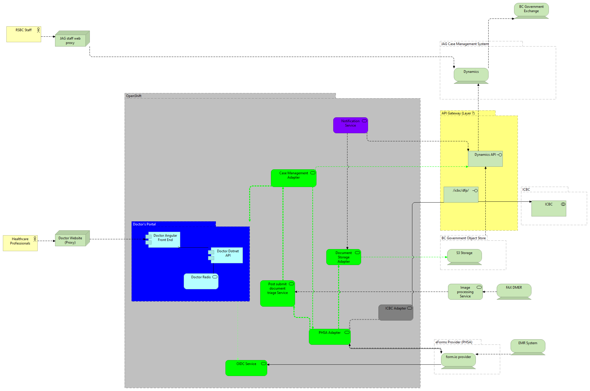

Road Safety BC Driver Medical Fitness
======================

Technology Stack
-----------------

| Layer   | Technology | 
| ------- | ------------ |
| Presentation | Angular 13 |
| Business Logic | C Sharp - Dotnet Core 6.0 |
| Microservices | C Sharp - Dotnet Core 6.0 |
| Front End Web Server | Caddy |
| Application Server | Kestrel |
| Data Storage | MS Dynamics On Premise V9 |
| Authentication | ADFS, BC Services Card |
| Document Storage    | S3 |
| Container Platform | OpenShift 4 |
| Zero Trust Security Policy Type | Kubernetes |
| Logging | Splunk, Console, and Kibana |
| CI/CD Pipeline | GitHub Actions, Kubernetes Pipelines (Tekton) |

System Architecture
--------------

Repository Map
--------------

- **functional-tests**: Source for BDD tests
- **openshift**: Various OpenShift related material, including instructions for setup and templates.

Installation
------------
This application is meant to be deployed to RedHat OpenShift version 4. Full instructions to deploy to OpenShift are in the `openshift` directory.

Developer Prerequisites
-----------------------

**Public Application**
- .Net Core SDK (6.0)
- Node.js 
- .NET Core IDE such as Visual Studio or VS Code
- JAG VPN with access to MS Dynamics

**DevOps**
- RedHat OpenShift tools
- Docker
- A familiarity with GitHub Actions and Tekton Pipelines

Microsoft Dynamics, S3
---------------------------
A MS Dynamics instance containing the necessary solution files is required.  A S3 compatible object store is required for persistent files.

DevOps Process
-------------

## Github Actions

There are two main categories of Github Actions used in this project:

1. Continuous Integration - these pipelines are used to integrate code from a Fork into the main "develop" line
2. Continuous Delivery - these pipelines are used to assist in building code for delivery (deployment) in OpenShift.

An example of other Github Actions also used in the project is the stats action Code Cov uses.

## Tekton Pipelines

There is also a series of Tekton (Kubernetes) pipelines:

### Promotion to TEST
To promote code to TEST, login to OpenShift and start the Kubernetes Pipeline for Promote to Test.

### Promotion to TRAIN
To promote code to TRAIN, login to OpenShift and start the Kubernetes Pipeline for Promote to Train.

### Promotion to PROD
To promote code to PROD, login to OpenShift and start the Kubernetes Pipeline for Promote to Prod. Not that this pipeline will also make a backup of the current PROD deployment.

### Restore PROD from backup
If you wish to revert to the previous PROD deployment, login to OpenShift and start the Kubernetes Pipeline for Restore PROD from Backup.

Contribution
------------

Please report any [issues](https://github.com/bcgov/https://github.com/bcgov/rsbc-dmf/issues).

[Pull requests](https://github.com/bcgov/rsbc-dmf/pulls) are always welcome.

If you would like to contribute, please see our [contributing](CONTRIBUTING.md) guidelines.

Please note that this project is released with a [Contributor Code of Conduct](CODE_OF_CONDUCT.md). By participating in this project you agree to abide by its terms.

License
-------

    Copyright 2022 Province of British Columbia

    Licensed under the Apache License, Version 2.0 (the "License");
    you may not use this file except in compliance with the License.
    You may obtain a copy of the License at 

       http://www.apache.org/licenses/LICENSE-2.0

    Unless required by applicable law or agreed to in writing, software
    distributed under the License is distributed on an "AS IS" BASIS,
    WITHOUT WARRANTIES OR CONDITIONS OF ANY KIND, either express or implied.
    See the License for the specific language governing permissions and
    limitations under the License.

Maintenance
-----------

This repository is maintained by [BC Attorney General]( https://www2.gov.bc.ca/gov/content/governments/organizational-structure/ministries-organizations/ministries/justice-attorney-general ).

